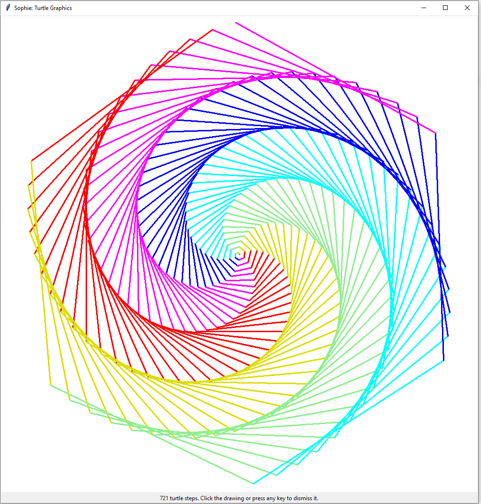

Learn Sophie (by Example)
=========================================

Welcome, and thank you for taking the time to learn Sophie.
She's a little different from what the average coding boot-camps are teaching these days,
but *vive la différence!* I hope she gives you a new perspective on CS.

.. contents::
    :local:
    :depth: 2

Initial Preparations
---------------------

Sophie is first and foremost a language for expressing ideas about computations that might happen.
That means you can write *and reason about* Sophie programs without any computer.
Sophie is meant to be suitable for the blackboard or publication in a magazine.
There are no special formatting requirements.

But if you'd like to put your computer up to the task of evaluating (executing, running) Sophie programs,
you'll need an interpreter. You can get one easily enough:
Follow the directions at :doc:`quick_start` and then come back here.

Your First Program in Sophie
------------------------------

Virtually every programming tutorial starts the same way:

.. literalinclude:: ../examples/hello_world.sg

If you followed directions earlier, you already have a copy of this program at ``examples/hello_world.sg``.

Now suppose you're at a command-prompt_ and you've set the current-directory_ to wherever you extracted Sophie.
If you then run::

    py -m sophie examples/hello_world.sg

you will see::

    Hello, World!
    All done here.

Let's break this down:

* Sophie programs are files.
* The main program begins with the phrase ``begin:``.
* Next comes a sequence of steps. Sophie follows those steps, one after another:

    * Each step is an *expression* of some value.
    * Sophie computes the value of that expression, and then displays the result.
    * Here we've only seen one kind of expression (the humble ``string``) but there are other kinds to handle all of computing.
    * If that expression should happen to be a ``drawing``, then the display is graphical. Sophie supports something called "Turtle Graphics". Deets later.
* Finally, every Sophie program ends with the phrase ``end.`` with a period.

    * Why? Because it looks nice in print.
    * Ok, the ``end.`` is now optional in response to some random dude on the internet with an opinion.
* At the moment, Sophie is implemented as a Python program.

    * So in general, you will invoke ``py -m sophie`` followed by the pathname_ to your program.
    * Some day, this may change. If you'd like to help that along, let's talk about something called *self-hosting*.

Super-Fancy Calculator
--------------------------

Here's a small program showing how math (and comments) in Sophie appears:

.. literalinclude:: ../examples/simple_calculations.sg

You can't miss the explanatory text on each line.
Sophie sees the ``#`` mark and concludes that the remainder of that line is a comment.
(This is a fairly typical convention.)
Comments are great for telling *people* about your code, for Sophie ignores them.

Let's break down the meaning of each expression, line-by-line:

* ``3 + 4 * 5``: Produces ``23`` because multiplication comes before addition.
* ``( 3 + 4 ) * 5``: Produces ``35`` because parenthesis.
* ``sqrt(1+1)``: Produces ``1.4142135623730951``.
  The name ``sqrt`` refers to a pre-defined function which computes the square-root of what you give it.
  This expression means to apply the number ``2`` to the function called ``sqrt`` and use the result.
  Some functions take more than one input value: just put a comma (``,``) between each parameter.

You can see more examples in the ``some_arithmetic.sg`` example file.

* Exercise:
    Find the ``some_arithmetic.sg`` example file. Read it (say, in *notepad* or *textedit*)
    and run it through the Sophie interpreter.
    This should be very similar to running the ``hello_world.sg`` example.
    What does this say about how Sophie reads mathematical expressions?

.. important::
	Sophie will only run a program she can read and understand completely in advance.
	Otherwise you'll get a diagnostic message to try to help you sort out what went wrong.
	These messages are not in their final form, but they should at least pinpoint the issues.

* Exercise:
	Modify the ``some_arithmetic.sg`` example file and save your changes,
	then try to run the modified version.
	What happens if you leave out a closing parenthesis, or leave out an operator between numbers?
	Can you make sense of the diagnostic messages?

Define your own!
------------------

Functions are the backbone of programming.
Indeed, all of computing amounts to evaluating functions of varying complexity.
So it's time to talk about how to make and use them.

The usual standard explanation would begin something like this:

.. literalinclude:: ../examples/define_functions.sg

We have here a simple Sophie program that defines three functions, called ``double``, ``square``, and ``area_of_rectangle``.
It also defines a constant, called ``five``, which conveniently enough refers to the number ``5``.

If you're curious (and I hope you are) you can run it like::

	D:\GitHub\sophie>py -m sophie examples\define_functions.sg
	10
	25
	50
	100
	600

Let's break this down:

* In Sophie, the definitions of functions (and constants) go in a section introduced with ``define:``.
* In this program, the names ``x``, ``length``, and ``width`` serve as *formal parameters*.
  That means the ``x`` in  ``double(x)`` is a place-holder for whatever other actual value.
  Same for ``length`` and ``width`` in ``area_of_rectangle``.
* When you want to write a function of more than one parameter, separate them by a comma.
* You can, of course, refer to functions from within functions.

.. admonition:: Names are Important

    Consider the implications if ``five`` were instead called ``six`` in a large program:
    People might look at the word *six* and mistakenly guess that it would mean ``6``,
    as it *would* in a sane world.

    This sort of treachery is typically called *unmaintainable* by those in the business,
    but I have a better word for it: *unethical*. Don't do it.
    Pick names that evoke the proper meaning.
    If the meaning is abstract, pick an abstract name.
    The most abstract names of all are single letters near the end of the alphabet.

Apples and Oranges
--------------------

Introducing the Type Checker
.............................

One of Sophie's key features is something called *static type-safety*.
Before she runs any program, Sophie checks it carefully to make sure that
no part of the program can produce a value of the wrong type for what uses it.
By that I mean:

* Numbers are in places where numbers can go.
* Text strings are in places where text strings can go.
* Lists are in places where lists can go.
* And so on, including all the types you define in your own programs.

Try this bit of nonsense:

.. literalinclude:: ../zoo/fail/type_check/num_plus_string.sg

When you try to run this nonsense (and note the ``-c`` flag on the command line)::

    D:\GitHub\sophie>py -m sophie zoo\fail\type_check\num_plus_string.sg -c
    Loading D:\GitHub\sophie\zoo\fail\type_check\num_plus_string.sg
    -/-
    Error while Checking Types: Needed number; got something else.
    Excerpt from D:\GitHub\sophie\zoo\fail\type_check\num_plus_string.sg :
         4 :begin: 1 + "one"; end.
                       ^^^^^ This expression has type string.

Sophie worked out this addition of a number to text doesn't make any sense,
and so gave us fair notice that something is not right about how we're using that ``+`` sign.

This was a super-simple example, just to show the concept.
Sophie carries this same checking through any depth of functions and data structures.
This turns out to be a big help as your programs gets big:
It's easy to forget some relevant detail, but Sophie will remind you.

Admittedly, these particular messages are not exactly God's gift to aspiring programmers,
but I've tried to make them informative, and in time Sophie might get better in this regard.

* Exercise:
    Try introducing some deliberate type-errors into the ``define_functions.sg`` example,
    such as taking the square of ``"hello"``, and see what sorts of messages Sophie generates.

.. note::
	There's a truism commonly repeated for languages with strict static typing:
	*If it compiles, it probably works.* That's the attraction, and in this author's
	experience it's worth the price of admission. However, do not mistake *type* safety
	for *program* safety. If you're running safety-critical systems (e.g. medical implants,
	nuclear power plants, avionics, or the brake pedal in a certain well-known automobile)
	then you need a *much* higher degree of quality assurance. But that's a rant for another day.

Checking Programs Without Running Them
.......................................

You can ask Sophie to check your program without running it, using the ``-c`` option.
In that case, Sophie will list the inferred types of all the functions::

	D:\GitHub\sophie>py -m sophie examples\define_functions.sg -c
	Loading D:\GitHub\sophie\examples\define_functions.sg
	2 >> double : (number) -> number
	2 >> square : (number) -> number
	2 >> area_of_rectangle : (number, number) -> number
	1 >> five : number

Here we see the inferred types. The arrows mean "function".
For example, ``area_of_rectangle`` is a function from ``(number, number)`` to ``number``.
By contrast, ``five`` is just a number.

* Exercise:
	Check the types of all the examples.
	Does anything surprise you?

How to Influence Type-Checking
...............................

If Sophie comes to surprising (or inadequate) conclusions about the types of your functions,
it's possible to add *type annotations* to make Sophie take your intentions into account.

For example, you could write::

	area_of_rectangle(length:number, width:number):number = length * width;

which means that the two parameters (``length`` and ``width``) both have type ``number``,
and so does the result of the function.
Sophie will still check that these assertions work with the function's body expression ``length * width``
rather than blindly take your word for things, but otherwise this can be a good way to narrow down the type
Sophie infers.

The simple types are ``string``, ``number``, and ``flag``. There are also some predefined types like ``list``.
In fact, ``list`` can take a parameter, as in ``list[number]`` or ``list[string]``.

* Later in this tutorial, a section will cover the rest of the syntax for type annotations in more detail.

Type annotations are all completely optional. You may annotate any combination of parameters,
return-types, or nothing at all and just let Sophie read your mind.
Type annotations are rarely necessary from Sophie's perspective,
but they can be a nice adjunct to explanatory comments, since they get checked automatically.

.. note::
	At the moment, type inference works pretty well but it is not *quite* finished.
	You may find it handy to use type annotations to fill holes in what Sophie can see.

* Exercise:
	Try giving an incorrect type annotation to a function, and see what happens.
	For example, maybe you write ``double(x:flag) = x + x;``

More Fun with Functions
-------------------------

You can do quite a bit with functions.
Consider this example::

.. literalinclude:: ../examples/Newton.sg

This program illustrates Isaac Newton's method for figuring square-roots.
The method achieves excellent accuracy after just a few steps if you start with a decent guess.
(Start with a bad guess, and it takes a few extra steps. Selecting good guesses is a topic for another time.)

Once again, let's study the bits.

* ``iterate_four_times`` is a function which *takes a function* as one of its parameters.
  The *body expression* is to call that function on the result of... well, you get the point.
  (One convention to make this scenario clear is visible in how the parameters are named:
  ``fn`` is commonly the name of a function. Similarly, ``x`` is often a number.)

* The first key point about ``root`` is the ``where`` clause.
  It allows you nest functions within functions (within functions... etc.).
  In this case, ``newton`` is defined within ``root``.
  That's useful for two things:

  * First, it hides the internals. If ``newton`` is only relevant to ``root``,
    then only ``root`` needs to see ``newton``. This is a good way to limit the amount
    of information you need to keep in your head at once.

  * Second, it allows ``newton`` to see values that only exist within the context of ``root``.
    Specifically, ``newton`` can use the value of ``square`` even when ``iterate_four_times`` calls it.
    This phenomenon is called *closure*.

More Apples and More Oranges
..............................

* *Take a look at type-report and ``iterate_four_times`` specifically.*
* *Discuss the types of higher-order functions generally.*

Making Decisions
--------------------

So far, we've seen arithmetic and how to use functions, but no way to decide between options.
Let's fix that.
Sophie has three of what we call *conditional forms,* or ways to represent decision-points in a program.
I'll cover the first two of these here, and the last in the section about data structures.

Case Study: Age Classifier
...........................
Here's an example of a not-always-totally-respectful age-classifier::

.. literalinclude:: ../examples/case_when.sg

The ``case`` - ``when`` - ``then`` - ``else`` - ``esac`` structure
represents a multi-way decision.
You might not agree with the precise thresholds or translations,
but what's going on should be pretty clear.
Sophie looks for the first ``when`` clause that is true in context,
and evaluates the corresponding ``then`` clause.
If no ``when`` clause is true, then Sophie evaluates the ``else`` clause instead.

	And what about that funny word ``esac``? Well, it's ``case`` spelled backwards.
	It makes for a nice symmetric open-and-close, sort of like parentheses.
	We could probably live without it for this particular structure
	because ``else`` is always last here,
	but Sophie uses the word ``case`` in a couple other ways where clear
	containment is less obvious without the closing bracket.
	So this is a nod to consistency,
	which will make for easier composition and reading.

* Exercise:
	Observe that this demo calls the ``age`` function with a few different
	sample arguments ``1``, ``10``, and ``100``. Think about what result you expect
	in each of these scenarios, and why that is the result you expect.

* Exercise:
    We haven't yet seen the ``map`` function. Based on how it's used here,
    what do you suppose it might do?

* Exercise:
	Actually run the example code.
	See how things line up with your expectations.

* Exercise:
	Try mixing up the order in which the ``when`` ... ``then`` clauses appear.
	What happens?
	Can you adjust the ``when`` conditions to make them work properly regardless of the order in which they appear?

* Exercise:
	Can you think of a way for Sophie to check for overlap between the conditions?
	If so, how does your idea change when the conditions get more complicated?

Case Study: Improved Root-Finder
...................................

Let's improve our root-finding program.
You may have noticed that it did significantly better with ``root(2)`` than with ``root(17)``.
To get a better answer for larger numbers, one approach we could take is to iterate Newton's method more times.
We could do this::

.. literalinclude:: ../examples/Newton_2.sg

..

    For the record, ``sqrt`` is the built-in math function for taking square-roots,
    so that's convenient for testing against.

In this example, I've added two more rounds of Newton's Method (and renamed a certain function accordingly).
Even still, it's not enough.
Feed a big enough number into the ``root(...)`` function and it stops too soon.

	Of note, you can have underscores in numbers
	like ``123_465.789_012`` and you can group them as you like,
	so long as there is a digit on both sides of every underscore.

It would be nice if we could let Sophie figure out when to stop.
Perhaps we come up with a function like this::

.. literalinclude:: ../examples/Newton_3.sg

Success! But ... What just happened? There's a lot going on in this case-study.

1. | The body-expression of ``iterated`` shows the first of the conditional forms:
   |    *expression-1* ``if`` *test* ``else`` *expression-2*.

2. So-called *where-clauses* can have as many definitions as you like.
   The main ``root`` function defines two sub-functions in this manner.

3. You can nest sub-functions as deeply as you like.
   The function ``good_enough`` is within ``iterated``, which itself is within ``root``.

4. In the function ``good_enough``, we meet `scientific notation`_.
   ``1e-14`` is one over ten trillion, or a very *very* small number for most practical purposes.

5. The built-in function ``fabs`` stands for "absolute-value of" and is effectively ``fabs(x) = x if x >= 0 else -x``,
   but in native code. The ``f`` in ``fabs`` comes from a historical accident, and I will probably remove it
   from a near-future version of the interpreter.

6. This illustrates a design technique: The function ``iterated(x, y)`` does most of the work,
   and is `recursive`_ with two parameters. So the outer function ``root(square)`` must
   provide an initial set of values for those parameters.

   When you write a recursive algorithm, you should spend a moment to convince yourself that it always terminates.
   In our case, Isaac Newton has already done most of the work four hundred years ago,
   as long as you start with a positive number.
   It might not go so well if you feed in a negative number, but that's a topic for a bit later on.

7. There are limits to the precision of numerical operations in computers.
   The built-in ``sqrt`` can determine square-roots to slightly more precision in a single operation
   than what we can accomplish with several separate operations. (It's also much faster.)

.. _scientific notation: https://en.wikipedia.org/wiki/Scientific_notation#E_notation
.. _recursive: https://en.wikipedia.org/wiki/Recursion_(computer_science)

..

    Normally, it's best to use the standard-library functions rather than re-build from scratch.
    But then again, normally you'll already know how to use the langauge.
    This exercise is just practice for learning the concepts.

Wrapping Up
..............

We have seen how to do multi-way selection based on conditions,
and we have seen a short-cut notation when there are only two options.
Internally, they both translate to the same form (and it resembles the "short-cut").
One or the other syntax will more or less represent how you think about
any given decision point.

Seven Moving Parts
-------------------

This might be a good point to pause and reflect.
You have seen functions and decision points.
In principle, that's enough to compute anything that can be computed.

The Holy Trinity of structured programming is *sequence, selection, and repetition*.
We're doing something even holier than structured, though.
We're doing *pure* functional programming with *call-by-need*.

So far, we've seen:

* Arithmetic and Logic.
* Selection among alternatives.
* Functional abstraction, by which we obtain sequence and repetition.

We've yet to tackle:

* Organizing information internal the program for proper access.
* Influencing the world, such as displaying something or writing to long-term storage: Output.
* Getting information from the outside world into the program: Input.
* Interconnecting sections of program written by different people at different times and places: a module system.
* The eventual plans for solving *big* problems with Sophie.

Fantastic Lists and Where to Find Them
--------------------------------------------

So far, almost all the data in the tutorial has been numbers,
with the occasional bit of text (what programmers often call "strings" for historical reasons).
In the small, most things do boil down to letters and numbers,
but we're often interested in treating coherent groups of information as a unit.
In other words, we want structured data.

Sophie provides two primary data structuring conventions: records and variants.

Case Study: Music Archive
..........................

Suppose you're going to write some code that deals with a library of music.
You might end up with some type definitions like this::

	type:
	year is number;
	track is (title:string, artist:string, published:year, recorded:year);
	album is (title:string, published:year, tracks:list[track]);

Line by line:

1. The ``type:`` section goes before any ``define:`` or ``begin:`` section.
2. The word ``year`` is made a synonym for ``number``.
3. Next, ``track`` is defined to have a title, artist, year of publication, and year when it was recorded.
4. Finally, we define ``album`` to have its own title and year, but also a list of tracks.
   Thus, ``track`` and ``album`` are both record definitions.

Here's some sample expression of an album::

	sample = album("50 Public-Domain Songs", 2022, [
		track("After You Get What You Want, You Don't Want It", "Irving Berlin", 1925, 2021),
		track("Some of These Days", "Shelton Brooks", 1925, 2022),
	]);

	some_year = sample.published;

Notice a few things:

* Record definitions behave somewhat like functions.
  We can create an album or a track by giving arguments in the correct type and sequence.
* You can write a list of things with commas between and surrounded by square brackets.
  The syntax looks like ``[`` *element* ``,`` ... ``,`` *element* ``]``.
  If it makes life easier, you can optionally include a comma after the last element.
* An empty list is spelled ``nil``, even though we don't yet have an example here.

Lists in Sophie are sequences of all the same type of object. You can have lists of numbers,
lists of strings, lists of tracks, even lists of other lists;
but then those other lists must themselves all have the same type of entry.

So, for instance, ``[1, "apple"]`` is not a list because it contains elements of dissimilar type.

You can also make lists one element at a time, using the ``cons`` constructor.
These are two ways to write the exact same list::

	begin:
		cons(1, cons(2, cons(3, nil)));
		[1, 2, 3];
	end.

Obviously the second way is much preferable for many cases,
but when you're composing lists functionally it's handy to have the other.

Now, you might be wondering how to get at data in lists.
This is a good time to look at the code for the ``map`` built-in function::

	map(fn, xs) = case xs of
		nil -> nil;
		cons -> cons(fn(xs.head), map(fn, xs.tail));
	esac;

How to explain this? On two levels: what it does, and how it works.

* ``map`` takes a function (from type A to type B, let's say) and a ``list[A]``;
  and produces from these a ``list[B]`` by applying the function to each element in succession.

* ``map`` works by deconstructing each ``cons``, applying the function to the head, and constructing a new ``cons``.
  Naturally when it finds ``nil`` it's done.

For context, let's look at the definition of ``list``::

	list[x] is case:
		 cons(head:x, tail:list[x]);
		 nil;
	esac;

So, every ``list`` is *either* a ``cons`` or an empty-list (called ``nil``.)
We call ``cons`` and ``nil`` the two constructors of ``list``.
We *define* ``list`` with a ``case`` construction, and we *take apart* a ``list`` with a ``case`` construction.

Note that we don't *just* define ``list``. We actually define ``list[x]``.
The ``x`` is a placeholder for some other type: the element-type for any given list.
It works sort of like the argument to aa function: you can supply whatever ``x`` you need when you need it.
We go on to use ``x`` in the definition of the ``cons`` constructor.

Getting back to ``map``:
The phrase ``case xs:`` says we've got a different answer depending on which constructor ``xs`` is built with.
In the outer function body, ``xs`` is known only to be a ``list``,
but within the ``cons ->`` branch, ``xs`` certainly has the subtype of ``cons``,
so we can access ``xs.head`` and ``xs.tail`` only within that branch.

Case Study: Fibonacci Numbers
..............................

Everything you ever wanted to know about these numbers are at https://en.wikipedia.org/wiki/Fibonacci_number
but here's the extremely short version:

	You get an interesting *and endless* sequence of numbers by starting ``1, 1,``
	and then each next number is the sum of the two preceding ones.
	A slightly longer prefix of this sequence goes ``1, 1, 2, 3, 5, 8, 13, 21, 35,``
	but the sequence overall continues until you get tired of it.

	These numbers come up often in nature, music, art, and applied math,
	so it's handy to have a convenient way to get a list of them.

The usual mathematical definition of the Fibonacci sequence usually looks something
like ``fib(n) = 1 if n < 2 else fib(n-1) + fib(n-2);`` but that has three problems:

1. It defines the nth Fibonacci number, not the sequence of them all.
2. This style of recursive definition is rather difficult to make an efficient translation of.
   Some systems apply some clever tricks which can often help,
   but for the most part we can expect this *general category* of expression
   to require `exponential time <time_comp_>`_.
   Why? It breaks the larger problem into two smaller similar problems,
   but they are "smaller" by a only constant increment rather than a constant factor.
3. There happens to be a direct, non-recursive expression for the nth Fibonacci number.
   A text on discrete math will show you how to find such an expression.

What I'd like to do instead is define the infinite list of Fibonacci numbers,
and then have a convenient way to get a prefix of that list.
Here's one way to do it::

.. literalinclude:: ../examples/Fibonacci.sg

Discussion:

1. The Fibonacci sequence is something called a `linear recurrence relation <rec_rel_>`_.
   It is perhaps the simplest non-trivial one: each term is the sum of the two previous terms.
   I've captured the fact of that summation in the ``recur`` sub-function:
   it composes an infinite list.

2. The sequence specifically is that recurrence beginning with a pair of ones.
   A common pattern in the design of functions is to apply a specific set of initial conditions
   to a more generalized recursive core. We saw something similar in the design of the improved root finder, earlier.

3. An infinite list may be easy to define, but naturally you can't use the whole thing.
   You have to confine yourself to using a finite prefix of the infinite list.
   One way is the function ``take``, which is built-in to the `standard preamble`_.
   It takes a *size* (here, ``20``) and a source-list to produce a new list with at most *size* elements.
   For reference, here is the source code for ``take``::

	take(n, xs) = nil if n < 1 else case xs of
		nil -> nil;
		cons -> cons(xs.head, take(n-1, xs.tail));
	esac;

Exercises:

1. Critique the similarities and differences between how ``Fibonacci`` and ``take`` use the ``cons`` list-constructor.
2. Explain  why the ``take`` function *always* finishes. Don't just test it.
   Prove it. *(Hint:* mathematical_ induction_ *is your friend.)*
3. The `Lucas numbers`_ are similar, but they have a different starting value. Refactor this to provide both sequences.
4. The `Pell numbers`_ are again similar, but with a multiplication involved. How could you add support for these?
5. (Harder) Try composing a version of ``Fibonacci`` that takes a *size* argument and produces only that size of list,
   but without using ``take`` as a primitive.
   Now critique the mess you just made.
   How much harder was it to write, and later to read?
   Now you know why not to ever do that again.
   Instead, design and take full advantage of small composable functions.

.. _time_comp: https://en.wikipedia.org/wiki/Time_complexity
.. _rec_rel: https://en.wikipedia.org/wiki/Recurrence_relation
.. _mathematical: https://www.mathsisfun.com/algebra/mathematical-induction.html
.. _induction: https://en.wikipedia.org/wiki/Mathematical_induction
.. _Lucas numbers: https://en.wikipedia.org/wiki/Lucas_number
.. _Pell numbers: https://en.wikipedia.org/wiki/Pell_number

The built-in list-processing functions
.......................................

You can read the `standard preamble`_ to see all the relevant source code,
but here's a handy list of built-in list processing functions:

* ``any`` - Given a list of yes/no values, tell if *any* of them are a yes. (For an empty list, this will be *no*.)
* ``all`` -  Given a list of yes/no values, tell if *all* of them are a yes. (For an empty list, this will be *yes*.)
* ``map`` -  Given a function and a source-list, produce a new list composed by applying the function to each element of the source list.
* ``filter`` - Given a predicate (i.e. a function returning yes or no) and a source-list, produce a new list composed of every source-list element for which the predicate is true of that element.
* ``reduce`` - Described in detail below.
* ``cat`` -  Given two lists, produce a new list containing each element of the first list, and then each element of the second list.
* ``flat`` - Given a list-of-lists, produce a single-level list consisting of all the elements of each sub-list in succession.
* ``take`` - Given a number and a source-list, produce a new list containing at most the first *number* elements of *source-list*.
* ``skip`` - Given a number and a source-list, produce only that portion of *source-list* after the first *number* elements are skipped over.

A word about ``reduce``:
	The idea here is that you have a list and you want to crush it down into a single value.
	To do this, you have a function (of two parameters) and some *initial* value.
	This function, applied to the *initial* value and the head of the list,
	produces a new *intermediate* value. We then apply your function to the *intermediate* value and the *next* element of the list,
	over and over until we run out of list-elements. At that point, whatever was the last value to be returned from your function
	is the result of ``reduce``.

	Here's an example::

		sum(xs) = reduce(add, 0, xs) where add(a,b) = a+b; end sum;

	Many authors refer to this behavior as a *fold*, evoking the image of literally folding a strip of paper over on itself many times.
	Some authors might specifically call it a *left-fold* due to its dynamic of processing the elements in the list from first to last.
	There are perhaps around a dozen commonly-encountered variants of approximately this function.
	Some expect a seed value; some take the seed from the head of the list. Some work in reverse.
	Some try to form a balanced tree of sub-list sub-folds. Some might even work in parallel across different CPU cores.
	Some reverse the arguments to the provided function. Some produce only the final result;
	others produce the list of intermediate values.

	If there's a point, it's this: There are many interesting patterns of iteration.
	Some of those patterns may well have conventional names, but they're all just variations on a simple theme.
	At the moment, Sophie is not trying to *catch them all.*
	It's easy enough to just catch the ones you need when you need them.
	Eventually, Sophie might add a library of these so-called *morphisms*.

Turtle Graphics
----------------

**Sophie** has Turtle-graphics!

When I was a little kid, one fun thing to do in the school computer lab was to write short
Logo programs to make intricate designs with its distinctive turtle-graphics feature.
This was secretly also a nice introduction to several important aspects of the art of computer programming,
but we kids were all having way too much fun to notice. (Perhaps we might have learned more with more structure?)

In this early revision of **Sophie**, turtle graphics are available with no great effort.
The one genuinely new concept is an ``import:`` section. For now, just follow along.

Case Study: Simple Designs
............................

You can display drawings by composing ``drawing`` objects containing a list of ``turtle_step`` items.
Here's an example turtle-program that generates a couple designs:

.. literalinclude:: ../examples/simple_designs.sg

At this point, you can begin to make your own designs. Try it out; it's fun!

The plan is to add fun and interesting designs to `this program <https://github.com/kjosib/sophie/blob/main/examples/turtle.sg>`_.
Useful components (like ``repeat``, above) might move into either the preamble or a standard library module (once those get invented).

All the turtle-y things
.........................

To activate Sophie's turtle graphics:

1. Import the turtle-graphics library (as in the example), along with the particular symbols you want from it.
2. Construct ``drawing`` records in the ``begin:`` section of your module.

The turtle graphics module defines two data types::

	drawing is (steps: list[turtle_step]);

	turtle_step is case:
		forward(distance:number);
		backward(distance:number);
		right(angle:number);
		left(angle:number);
		goto(x:number, y:number);
		setheading(angle:number);
		home;
		pendown;
		penup;
		color(color:string);
		pensize(width:number);
		showturtle;
		hideturtle;
	esac;

I'm not *currently* supporting filled areas, predefined shapes, multiple turtles, or other sophisticated extras.
I might do some of those eventually, if there's demand.

Case Study: Color Spiral
...........................

That's a pretty picture. Let's see the code for it:

.. literalinclude:: ../examples/color_spiral.sg

At this point, interpreting the code is mostly left as an exercise for the reader.
Here are a couple of comments:

* This puts most of what you've learned to use.
* The color specifications can be well-known color names or RGB values expressed in hexadecimal,
  and prefixed by the hash mark ``#``. That's a consequence of the underlying turtle-graphics library.

Exercises:

* What are the *types* of the functions here?
* What does each definition achieve toward the pretty picture?
* The lack of commentary is not (necessarily) an endorsement.
  What comment would you make for each function,
  and who is your target audience for that comment?
* Invent a design of your own, and make it happen.
* Poke around in `turtle.sg <https://github.com/kjosib/sophie/blob/main/examples/turtle.sg>`_.
  What are your favorite designs, and why?
* Add a design and send it in!

Modular Design of Larger Programs
----------------------------------

* You may have noticed the definition of ``repeat`` repeated in each of the turtle-graphics case studies.
  How can we get away from repeating ourselves in that manner?

* Up to now, all the case-studies have been composed of a single file (each).
  For larger projects, you'll probably want to split your code up into multiple files,
  each concerned with some particular aspect of the overall solution.

Sophie supports both of these ideas with a shared-module system.

Consider a file called ``library.sg``:

.. literalinclude:: ../examples/library.sg

And consider also another file called ``patron.sg``, which uses the library:

.. literalinclude:: ../examples/patron.sg

What's new here, then?

* The *shared-module* file can define both types and functions. In this case, it defines the function ``nice_book``.
* The *client* of that module can *import* the shared module, and then use types and functions defined therein.
  In this case, it uses the ``nice_book`` function from the shared library.

  * Use an ``import:`` section if you want to do this. It must come first, before any ``type:`` or ``define:`` section.
  * The phrase ``"library.sg" as lib;`` means that words from file *library.sg* will be available with the suffix ``@lib``.
    For example, we can say ``nice_book@lib``.
  * You can import as many modules as you like, but they must all use distinct ``@`` suffixes.
  * You can import modules that import other modules.
  * You can put arbitrary file paths between the double-quotes. (However, do not use the ``\`` character.
    Use ``/`` instead.) Relative paths are interpreted relative to the file making the import,
    not the current working directory.
  * A circular chain of imports would be considered a mistake.

You can run this program as follows::

	D:\GitHub\sophie>py -m sophie examples\patron.sg
	Gulliver's Travels

I'll grant it's not a very imposing result, but it shows that the mechanism works -- at least to some degree.
You can read more about different ways to use modules in the :doc:`reference`.

All the other bits
------------------

These sections are still on the drawing board...

* Module / Package system
    * Explicit export lists
    * Launch configurations
* Partial functions
* List-builder notation
* Starmap-like functors
* Input from files
* Input from the console, and other event-driven things
* Ad-hoc polymorphic multimethods (sort of; I have some notions.)

Congratulations
-----------------
If you've gotten this far, you have taken a step into a wider world.

You can reach the author at kjosib@gmail.com.

.. _pathname: https://www.google.com/search?q=define+pathname
.. _command-prompt: https://www.google.com/search?q=define+command+prompt
.. _current-directory: https://www.google.com/search?q=define+current%20directory
.. _standard preamble: https://github.com/kjosib/sophie/blob/main/sophie/preamble.py