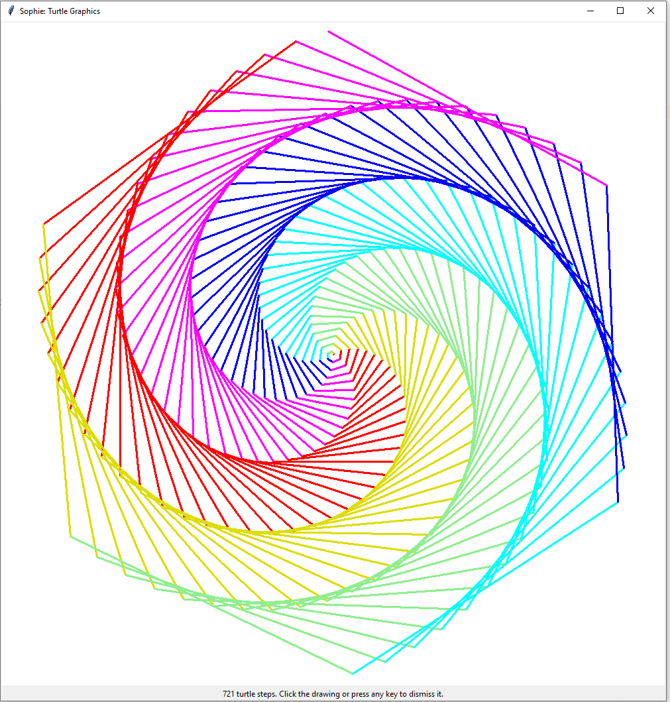

Turtle Graphics
~~~~~~~~~~~~~~~~

.. contents::
	:local:
	:depth: 3

**Sophie** has Turtle-graphics!

When I was a little kid, one fun thing to do in the school computer lab was to write short
Logo programs to make intricate designs with its distinctive turtle-graphics feature.
This was secretly also a nice introduction to several important aspects of the art of computer programming,
but we kids were all having way too much fun to notice. (Perhaps we might have learned more with more structure?)

In this early revision of **Sophie**, turtle graphics are available with no great effort.
The one genuinely new concept is an ``import:`` section. For now, just follow along.

Case Study: Simple Designs
----------------------------

You can display drawings by composing ``drawing`` objects containing a list of ``turtle_step`` items.
Here's an example turtle-program that generates a couple designs:

.. literalinclude:: ../../examples/turtle/simple_designs.sg

At this point, you can begin to make your own designs. Try it out; it's fun!

The plan is to add fun and interesting designs to `this program <https://github.com/kjosib/sophie/blob/main/examples/turtle/turtle.sg>`_.
Useful components (like ``repeat``, above) might move into either the preamble or a standard library module (once those get invented).

All the turtle-y things
-------------------------

To activate Sophie's turtle graphics:

1. Import the turtle-graphics library (as in the example), along with the particular symbols you want from it.
2. Construct ``drawing`` records in the ``begin:`` section of your module.

The turtle graphics module defines two data types::

	drawing is (steps: list[turtle_step]);

	turtle_step is case:
		forward(distance:number);
		backward(distance:number);
		right(angle:number);
		left(angle:number);
		goto(x:number, y:number);
		setheading(angle:number);
		home;
		pendown;
		penup;
		color(color:string);
		pensize(width:number);
		showturtle;
		hideturtle;
	esac;

I'm not *currently* supporting filled areas, predefined shapes, multiple turtles, or other sophisticated extras.
I might do some of those eventually, if there's demand.

Case Study: Color Spiral
---------------------------

That's a pretty picture. Let's see the code for it:

.. literalinclude:: ../../examples/turtle/color_spiral.sg

At this point, interpreting the code is mostly left as an exercise for the reader.
Here are a couple of comments:

* This puts most of what you've learned to use.
* The color specifications can be well-known color names or RGB values expressed in hexadecimal,
  and prefixed by the hash mark ``#``. That's a consequence of the underlying turtle-graphics library.

Exercises:

* What are the *types* of the functions here?
* What does each definition achieve toward the pretty picture?
* The lack of commentary is not (necessarily) an endorsement.
  What comment would you make for each function,
  and who is your target audience for that comment?
* Invent a design of your own, and make it happen.
* Poke around in `turtle.sg <https://github.com/kjosib/sophie/blob/main/examples/turtle/turtle.sg>`_.
  What are your favorite designs, and why?
* Add a design and send it in!
